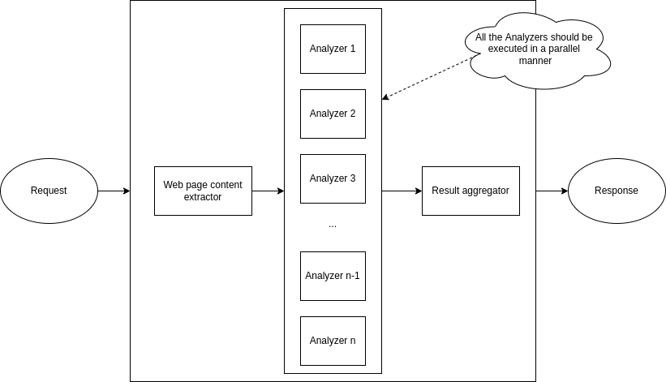

# WebPage Analyzer

## Introduction

The objectives of this project are as follows;

```
The objective is to build a web application that does an analysis of a web-page/URL.

The application should show a form with a text field in which users can type in the URL of the webpage to be analyzed. Additionally to the form, it should contain a button to send a request to the server.

After processing the results should be shown to the user.

Results should contain next information:

-   What HTML version has the document?
-   What is the page title?
-   How many headings of what level are in the document?
-   How many internal and external links are in the document? Are there any inaccessible links and how many?
-   Does the page contain a login form?

In case the URL given by the user is not reachable an error message should be presented to a user. The message should contain the HTTP status code and a useful error description. 
```

## Design and Architecture

The information to be displayed to the user are based on the rule(analyzer) executions against a given web page. Thus, the design of this solutions should contain the following.

1. Analyzers should be isolated and new analyzers should be able to add to solution or existing analyzer modifications should not be affected to the rest of the rules.
2. Since number of analyzers can be introduced, analyzer execution should be happened in a multi-threaded manner. This would leverage a good response time.



## Solution Implementation

For the implementation of this solution, following techs were used.

- Backend - Golang `1.16`
- Frontend - Angular `14.2`

### Note
This discusses the backend development of this solution.

## Development

Package structure is as follows;

- `analyzers` - This contains all the web page analyzers that are being used.
- `channels` - This contains the channel related which uses to check the link reachability.
- `config` - This contains the configuration reader in yaml files.
- `frontend` - This contains the Angular dist.
- `handlers` - This contains the HTTP handler implementation using `GIN framework`.
- `mocks` - This contains mocks that use for unit tests using `gomock`. 
- `test` - This contains the unit tests.

### Used external libraries

Following external libraries were used for the development.

1. [Gin framework](https://github.com/gin-gonic/gin) - This uses as the web framework in order to handle HTTP requests and responses.
2. [GoMock](https://github.com/golang/mock) - This uses as to generate the mocks that requires to when writing unit tests.
3. [Testify](https://github.com/stretchr/testify) - This uses for assertions in unit tests.

### Unit tests

Currently, this project covers with around `62%` of code coverage. To execute unit tests, use the following command.

```
go test ./... -v -cover -coverpkg=./... -coverprofile=cover.out
```
This generates the `cover.out` file which is used by the SonarQube.

### Mocks generation/update

In order to generate or update mocks(when a new contract is added or modified), `mockgen` command should be executed. Having said that, this should be installed as a Go module first. More information can be found from [here](https://github.com/golang/mock).

To update current mocks, use the following commands appropriately.

```
mockgen -source="handlers/http/responses/success_analysis_response.go" -destination="mocks/success_analysis_response_mock.go" -package=mocks
mockgen -source="analyzers/analyzer.go" -destination="mocks/analyzer_mock.go" -package=mocks
mockgen -source="analyzers/schema/analyzer_info.go" -destination="mocks/analyzer_info_mock.go" -package=mocks
mockgen -source="channels/url_executor.go" -destination="mocks/url_executor_mock.go" -package=mocks
mockgen -source="handlers/http/controllers/body_extractor.go" -destination="mocks/body_extractor_mock.go" -package=mocks
mockgen -source="channels/url_executor_provider.go" -destination="mocks/url_executor_provider_mock.go" -package=mocks
```
Alternatively, [mock.sh](mock.sh) file can be executed which contains the same as above..

### SonarQube Integrations

This project integrates with the SonarQube with an **external linter called** [GolangCI-Lint](https://github.com/golangci/golangci-lint) which is a linter aggregator for Golang. Current linter profile can be found from the [.golangci.yaml](.golangci.yaml) file which contains the linters that are being used.

`GolangCI-Lint` generates the `golangci-report.xml` file which is used by SonarQube to generate the report. In order to do this, `golangci-lint run` command should be executed. Having said that, this should be installed as a Go module first. More information can be found from [here](https://github.com/golangci/golangci-lint).

### [build.sh](build.sh)

Following tasks are carried out when executing this file.

- Formatting
- Cleaning
- Executing unit tests and preparing the `cover.out` file
- Executing the `GolangCI-Lint` for the given profile and preparing the `golangci-report.xml` file.
- Executing Sonar-scan

## Deployment

There are 2 ways to run the project.

1. `go run main.go` - After a git clone, project can be executed in this way.
2. `./webpage-analyzer` - Since this is the binary execution, this can be done after a successful code build. Having said that, `app.yaml` file should be in the appropriate path from where the binary gets executed. 

### Note
As an improvement, containerization can be done using docker.

## Endpoints

This contains 2 endpoints;

1. `GET` `/v1/analyze?url=<URL>` - This serves the analysis report for the given URL which should be passed as a query param.
2. `/` - This serves static content which is supposed to use for the front end.

